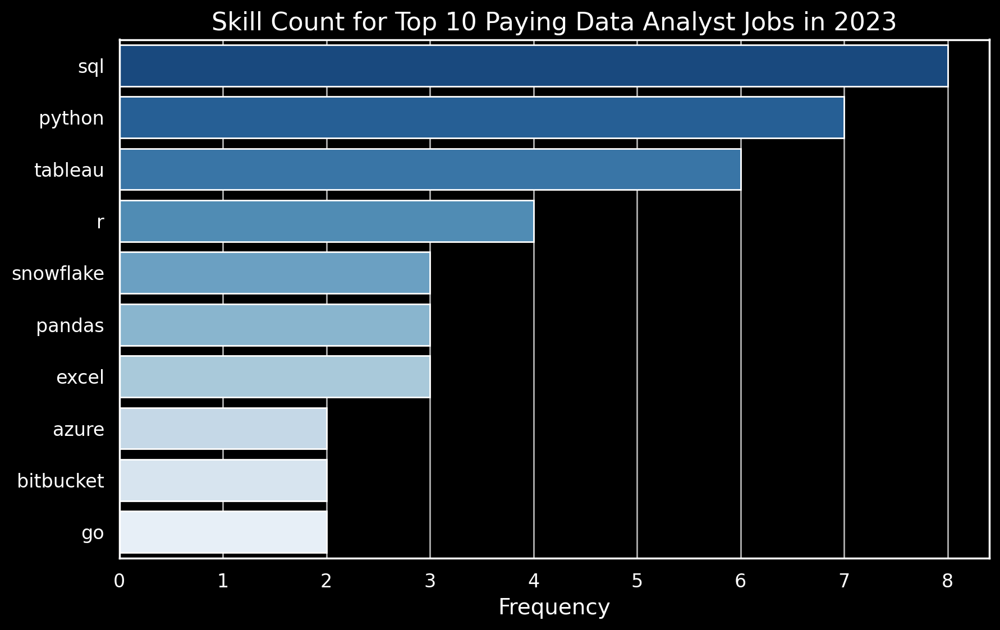

# Introduction
📊 Step into the data job market! This project focuses on exploring data analyst roles, uncovering 💰 top-paying positions, 🔥 in-demand skills, and 📈 where high demand intersects with lucrative salaries in data analytics.

🔍 Curious about SQL queries? They're available in the [project_sql folder](/project_sql/).

# Background
Motivated by the goal of navigating the data analyst job market more effectively, this project originated from the need to pinpoint top-paying and sought-after skills, streamlining the process of finding optimal jobs.

Data was sourced from my [SQL Course](https://lukebarousse.com/sql), providing valuable insights into job titles, salaries, locations, and essential skills.

### Key Questions Addressed Through SQL Queries:

1. What are the highest-paying data analyst positions?
2. What skills are essential for these top-paying roles?
3. Which skills are most in demand among data analysts?
4. Which skills are correlated with higher salaries?
5. What are the most beneficial skills to acquire?

# Tools Utilized
In delving deep into the data analyst job market, I utilized several indispensable tools:

- **SQL:** The foundation of my analysis, enabling database querying and uncovering critical insights.
- **PostgreSQL:** Chosen for its robustness in managing job posting data.
- **Visual Studio Code:** My primary tool for database management and executing SQL queries.
- **Git & GitHub:** Crucial for version control, sharing SQL scripts, and facilitating collaboration and project tracking.

# The Analysis
Each query in this project aimed to explore specific facets of the data analyst job market. Here's the approach taken for each question:

### 1. Top Paying Data Analyst Jobs
To identify the highest-paying roles, data analyst positions were filtered based on average yearly salary and location, with a focus on remote opportunities. This query highlights lucrative prospects within the field.

```sql
SELECT	
	job_id,
	job_title,
	job_location,
	job_schedule_type,
	salary_year_avg,
	job_posted_date,
    name AS company_name
FROM
    job_postings_fact
LEFT JOIN company_dim ON job_postings_fact.company_id = company_dim.company_id
WHERE
    job_title_short = 'Data Analyst' AND 
    job_location = 'Anywhere' AND 
    salary_year_avg IS NOT NULL
ORDER BY
    salary_year_avg DESC
LIMIT 10;
```
### Breakdown of Top Data Analyst Jobs in 2023:

- **Wide Salary Range:** The top 10 highest-paying data analyst roles range from $184,000 to $650,000 annually, highlighting substantial salary potential within the field.
- **Diverse Employers:** Companies such as SmartAsset, Meta, and AT&T offer competitive salaries, demonstrating widespread interest across diverse industries.
- **Job Title Variety:** There is a diverse array of job titles ranging from Data Analyst to Director of Analytics, reflecting the varied roles and specializations within the field of data analytics.


*This bar graph visualizes the salary distribution among the top 10 data analyst roles; generated from SQL query results.*

### Skills Required for Top Paying Jobs:

To comprehend the skills necessary for high-paying data analyst positions, I integrated job postings with skills data, offering insights into the competencies valued by employers for roles with significant compensation.
```sql
WITH top_paying_jobs AS (
    SELECT	
        job_id,
        job_title,
        salary_year_avg,
        name AS company_name
    FROM
        job_postings_fact
    LEFT JOIN company_dim ON job_postings_fact.company_id = company_dim.company_id
    WHERE
        job_title_short = 'Data Analyst' AND 
        job_location = 'Anywhere' AND 
        salary_year_avg IS NOT NULL
    ORDER BY
        salary_year_avg DESC
    LIMIT 10
)

SELECT 
    top_paying_jobs.*,
    skills
FROM top_paying_jobs
INNER JOIN skills_job_dim ON top_paying_jobs.job_id = skills_job_dim.job_id
INNER JOIN skills_dim ON skills_job_dim.skill_id = skills_dim.skill_id
ORDER BY
    salary_year_avg DESC;
```
### Breakdown of Most Demanded Skills for the Top 10 Highest Paying Data Analyst Jobs in 2023:

- **SQL** leads with a significant count of 8 mentions.
- **Python** closely follows with 7 mentions.
- **Tableau** is highly sought after, with 6 mentions.
Other skills such as **R**, **Snowflake**, **Pandas**, and **Excel** demonstrate varying levels of demand.


*This bar graph illustrates the distribution of skills among the top 10 highest paying data analyst jobs; generated from SQL query results.*

### In-Demand Skills for Data Analysts:

This query facilitated the identification of skills most frequently requested in job postings, focusing attention on areas with high demand.
```sql
SELECT 
    skills,
    COUNT(skills_job_dim.job_id) AS demand_count
FROM job_postings_fact
INNER JOIN skills_job_dim ON job_postings_fact.job_id = skills_job_dim.job_id
INNER JOIN skills_dim ON skills_job_dim.skill_id = skills_dim.skill_id
WHERE
    job_title_short = 'Data Analyst' 
    AND job_work_from_home = True 
GROUP BY
    skills
ORDER BY
    demand_count DESC
LIMIT 5;
```
### Breakdown of Most Demanded Skills for Data Analysts in 2023:

- **SQL** and **Excel** continue to be fundamental, underscoring the importance of robust skills in data processing and spreadsheet manipulation.
- **Programming** and **Visualization Tools** such as **Python**, **Tableau**, and **Power BI** are crucial, highlighting the growing significance of technical competencies in data storytelling and decision support.

| Skills   | Demand Count |
|----------|--------------|
| SQL      | 7291         |
| Excel    | 4611         |
| Python   | 4330         |
| Tableau  | 3745         |
| Power BI | 2609         |

*Table of the demand for the top 5 skills in data analyst job postings*

### 4. Skills Based on Salary

Exploring the average salaries associated with different skills unveiled the highest-paying skills.
```sql
SELECT 
    skills,
    ROUND(AVG(salary_year_avg), 0) AS avg_salary
FROM job_postings_fact
INNER JOIN skills_job_dim ON job_postings_fact.job_id = skills_job_dim.job_id
INNER JOIN skills_dim ON skills_job_dim.skill_id = skills_dim.skill_id
WHERE
    job_title_short = 'Data Analyst'
    AND salary_year_avg IS NOT NULL
    AND job_work_from_home = True 
GROUP BY
    skills
ORDER BY
    avg_salary DESC
LIMIT 25;
```
### Breakdown of Top Paying Skills for Data Analysts:

- **High Demand for Big Data & ML Skills:** Analysts skilled in big data technologies like PySpark and Couchbase, machine learning tools such as DataRobot and Jupyter, and Python libraries including Pandas and NumPy command top salaries, highlighting the industry's emphasis on data processing and predictive modeling capabilities.

- **Software Development & Deployment Proficiency:** Proficiency in development and deployment tools like GitLab, Kubernetes, and Airflow indicates a lucrative intersection between data analysis and engineering, emphasizing skills that enable automation and efficient data pipeline management.

- **Cloud Computing Expertise:** Expertise in cloud and data engineering tools such as Elasticsearch, Databricks, and Google Cloud Platform (GCP) underscores the increasing importance of cloud-based analytics environments. Cloud proficiency significantly enhances earning potential in data analytics.

| Skills        | Average Salary ($) |
|---------------|-------------------:|
| pyspark       |            208,172 |
| bitbucket     |            189,155 |
| couchbase     |            160,515 |
| watson        |            160,515 |
| datarobot     |            155,486 |
| gitlab        |            154,500 |
| swift         |            153,750 |
| jupyter       |            152,777 |
| pandas        |            151,821 |
| elasticsearch |            145,000 |

*Table of the average salary for the top 10 paying skills for data analysts*

### 5. Most Optimal Skills to Learn

By integrating insights from demand and salary data, this query aimed to identify skills that are both highly sought after and command high salaries, providing a strategic direction for skill development.

```sql
SELECT 
    skills_dim.skill_id,
    skills_dim.skills,
    COUNT(skills_job_dim.job_id) AS demand_count,
    ROUND(AVG(job_postings_fact.salary_year_avg), 0) AS avg_salary
FROM job_postings_fact
INNER JOIN skills_job_dim ON job_postings_fact.job_id = skills_job_dim.job_id
INNER JOIN skills_dim ON skills_job_dim.skill_id = skills_dim.skill_id
WHERE
    job_title_short = 'Data Analyst'
    AND salary_year_avg IS NOT NULL
    AND job_work_from_home = True 
GROUP BY
    skills_dim.skill_id
HAVING
    COUNT(skills_job_dim.job_id) > 10
ORDER BY
    avg_salary DESC,
    demand_count DESC
LIMIT 25;
```

| Skill ID | Skills     | Demand Count | Average Salary ($) |
|----------|------------|--------------|-------------------:|
| 8        | go         | 27           |            115,320 |
| 234      | confluence | 11           |            114,210 |
| 97       | hadoop     | 22           |            113,193 |
| 80       | snowflake  | 37           |            112,948 |
| 74       | azure      | 34           |            111,225 |
| 77       | bigquery   | 13           |            109,654 |
| 76       | aws        | 32           |            108,317 |
| 4        | java       | 17           |            106,906 |
| 194      | ssis       | 12           |            106,683 |
| 233      | jira       | 20           |            104,918 |

*Table of the most optimal skills for data analyst sorted by salary*

### Breakdown of Most Optimal Skills for Data Analysts in 2023:

- **High-Demand Programming Languages:** Python and R are standout languages with high demand counts of 236 and 148 respectively. Despite their popularity, the average salaries for Python and R are around $101,397 and $100,499 respectively, indicating widespread availability of these skills.

- **Cloud Tools and Technologies:** Skills in specialized technologies such as Snowflake, Azure, AWS, and BigQuery show significant demand and relatively high average salaries. This underscores the increasing importance of cloud platforms and big data technologies in data analysis.

- **Business Intelligence and Visualization Tools:** Tableau and Looker are critical tools in data visualization and business intelligence, with demand counts of 230 and 49 respectively, and average salaries around $99,288 and $103,795.

- **Database Technologies:** Skills in both traditional and NoSQL databases (Oracle, SQL Server, NoSQL) remain highly sought after, with average salaries ranging from $97,786 to $104,534. This reflects the ongoing need for expertise in data storage, retrieval, and management.

# What I Learned

Throughout this project, I've significantly enhanced my SQL toolkit:

- **🧩 Complex Query Crafting:** Mastered advanced SQL techniques, including table merging and efficient use of WITH clauses.
- **📊 Data Aggregation:** Became proficient in data summarization using GROUP BY and aggregate functions like COUNT() and AVG().
- **💡 Analytical Wizardry:** Developed skills in converting complex questions into actionable SQL queries, enhancing real-world problem-solving abilities.

# Conclusions

### Insights

From the analysis, several key insights emerged:

1. **Top-Paying Data Analyst Jobs**: Remote roles offer diverse salary ranges, with the highest reaching $650,000.
2. **Skills for Top-Paying Jobs**: SQL proficiency is crucial for high-paying data analyst positions.
3. **Most In-Demand Skills**: SQL remains the top demanded skill among data analysts.
4. **Skills with Higher Salaries**: Niche skills like SVN and Solidity command premium salaries.
5. **Optimal Skills for Job Market Value**: SQL stands out as a highly valuable skill due to its demand and salary prospects in the data analyst job market.

### Closing Thoughts

This project not only advanced my SQL skills but also provided valuable insights into the data analyst job market. The analysis serves as a roadmap for prioritizing skill development and navigating the competitive landscape. Aspiring data analysts can leverage high-demand, high-salary skills to enhance their career prospects in data analytics, emphasizing continuous learning and adaptation to industry trends.